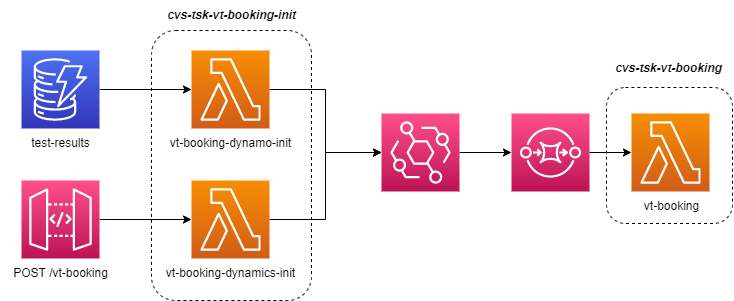

# cvs-tsk-vt-booking-init

## Overview

This repository contains the source code for two lambdas:

- `vt-booking-dynamics-init`
- `vt-booking-dynamo-init`

Both lambdas are part of initialising the ATOS booking integration process - receiving test booking events from both Dynamics CE (via API gateway) and VTA (via test-results DynamoDB stream events) and extracting the required information from said events to be then processed by the `vt-booking` lambda.

Both lambdas push a stringified JSON event onto an EventBridge with the format (pre-escaped):

```ts
{
  "name": 'hello',
  "bookingDate": '2022-01-01',
  "vrm": '12345',
  "testCode": '123',
  "testDate": '2022-01-01',
}
```

An overview of the architecture for the ATOS booking integration can be found below:

</br>
<p align="center">
  
</p>

## Running the project

**Requirements**

- node v14.17.3
- npm 7+

**Manually testing lambdas**

vt-booking-dynamics-init

- Build: `npm run build`
- Start: `npm run start`
- To invoke the lambda with a test event: `npm run invoke`
- To invoke the lambda with HTTP request:
  - Request: `POST http://localhost:8000/dev/vt-booking`
  - Body: `[{"name":"hello", "bookingDate":"2022-01-01", "vrm":"12345", "testCode":"123", "testDate":"2022-01-01", "pNumber":"1234"}]`

vt-booking-dynamo-init

- T.B.C

## Testing

- The [Jest](https://jestjs.io/) framework is used to run tests and collect code coverage
- To run the tests, run the following command within the root directory of the project: `npm t`
- Coverage results will be displayed on terminal and stored in the `coverage` directory
  - The coverage requirements can be set in `jest.config.js`

## Logging

Logging is handled by `https://github.com/winstonjs/winston`. A pre-configured logger is available, and can be used like so:

```ts
import logger from '../utils/logger';

logger.info('Hello world');
logger.error('Hello world');
logger.warn('Hello world');
```

## Contributing

To facilitate the standardisation of the code, a few helpers and tools have been adopted for this repository.

### External dependencies

The projects has multiple hooks configured using [husky](https://github.com/typicode/husky#readme) which will execute the following scripts: `audit`, `lint`, `build`, `test` and format your code with [eslint](https://github.com/typescript-eslint/typescript-eslint#readme) and [prettier](https://github.com/prettier/prettier).

You will be required to install [git-secrets](https://github.com/awslabs/git-secrets) (_brew approach is recommended_).

We follow the [conventional commit format](https://www.conventionalcommits.org/en/v1.0.0/) when we commit code to the repository and follow the [angular convention](https://github.com/conventional-changelog/commitlint/tree/master/%40commitlint/config-conventional#type-enum).

The type is mandatory and must be all lowercase.
The scope of your commit remain is also mandatory, it must include your ticket number and be all lowercase. The format for the ticket number can be set in the `commitlint.config.js` file.

```js
// Please see /commitlint.config.js for customised format

type(scope?): subject

// examples
'chore(cb2-1234): my commit msg' // pass
'CHORE(cb2-1234): my commit msg' // will fail

```
